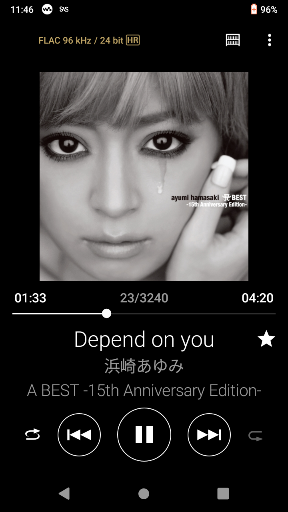
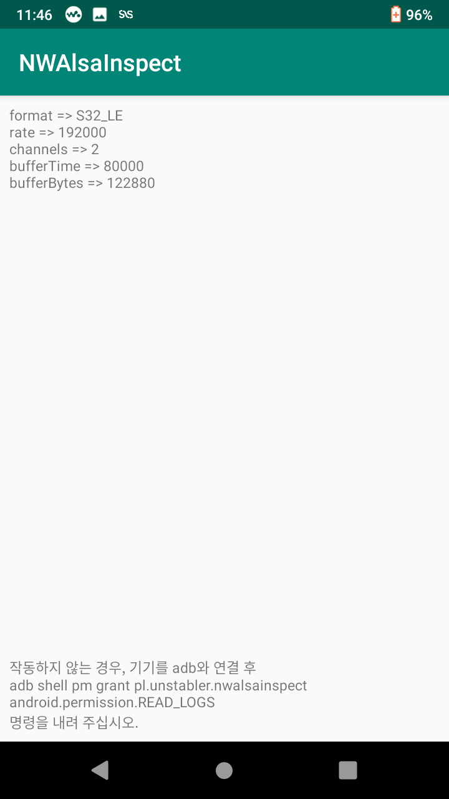
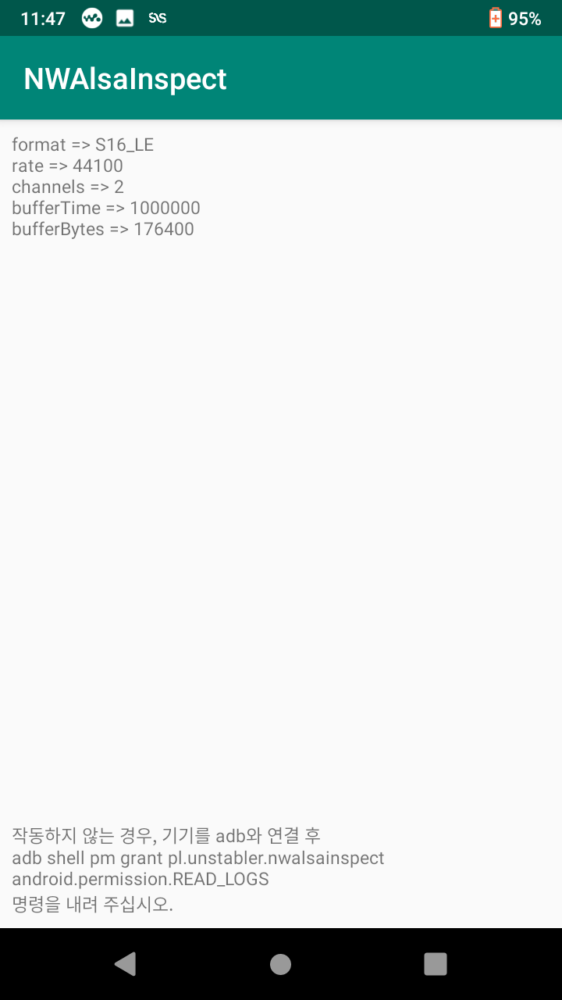
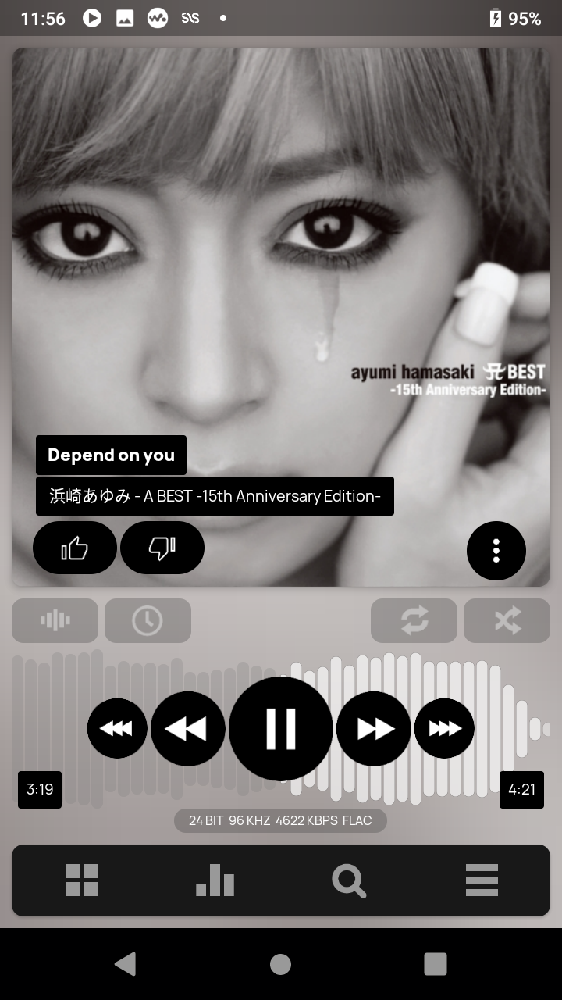
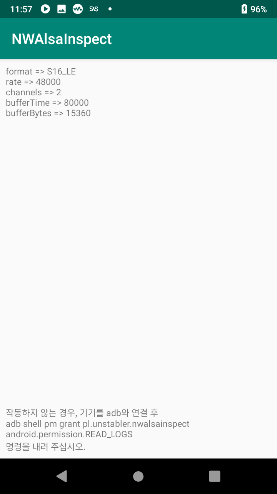

# NAME

NWAlsaInspect - NW-A100Series (NW-A105, NW-A106)で、使用しているアプリがちゃんとハイレゾ出力を行っているか確認できるようにします。

# SYNOPSIS

 

 

 

# DESCRIPTION

NW-A100シリーズは、オーディオの再生が行われる際、logcatにALSAを通じたオーディオ出力の情報を流します。これを読み込み、一番最後のログを表示します。 

ですので、`READ_LOGS`という特殊な権限を必要とし、初インストールの時、adbを使用して権限を与える必要があります。
