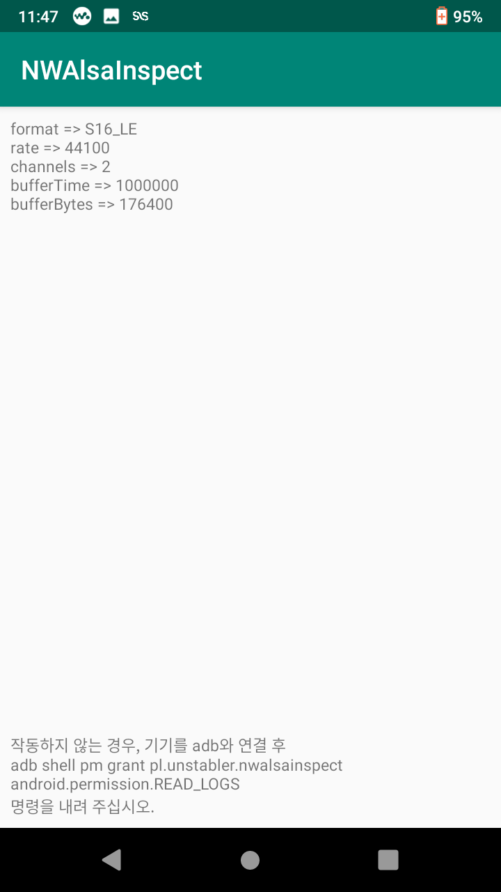
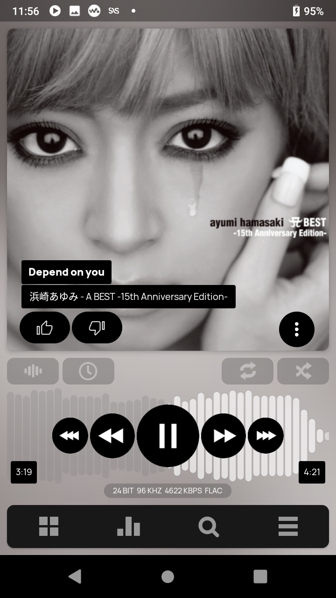

[日本語はこちら](./README.ja.md)

# NAME

NWAlsaInspect - NW-A100Series (NW-A105, NW-A106)에서 사용 중인 앱이 Hi-Res 출력을 하고 있는지 확인할 수 있게 해줍니다.

# SYNOPSIS

 

 

 

# DESCRIPTION

NW-A100 시리즈는 오디오 재생 시, logcat에 ALSA를 통한 오디오 출력 정보를 흘립니다. 이를 읽어서 가장 마지막 것을 표시합니다. 

따라서 `READ_LOGS`라는 특수 권한을 필요로 하며 첫 설치 시 디버깅 모드 연결을 통해 권한 부여를 해줄 필요가 있습니다. 
